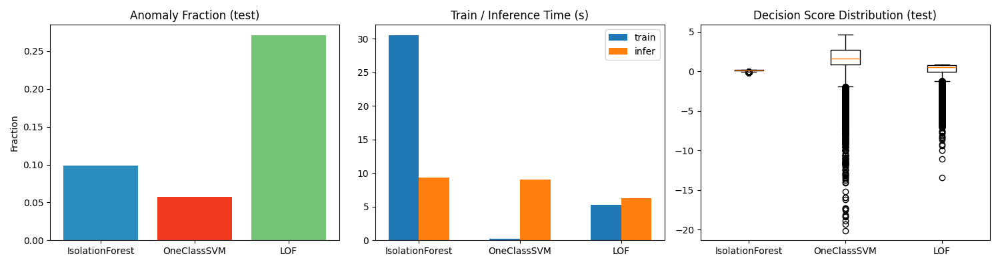
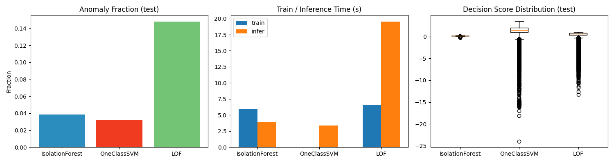

# Data Drift Detection and Anomaly Monitoring System

An end-to-end monitoring system for detecting distribution changes in server telemetry and identifying abnormal observations. It combines PSI and KS statistical drift detection, unsupervised anomaly models, a FastAPI service, SQLAlchemy persistence, and a Streamlit operations dashboard.

## 1. Overview

The system answers two operational questions:

- Has current server data changed from the training baseline?
- Is an individual server observation abnormal enough to investigate?

It uses the Server Machine Dataset and currently evaluates Machines 1, 2, and 3. The project is a development and evaluation platform that can be extended with production telemetry ingestion, alert delivery, model registries, and retraining workflows.

## 2. Problem and Solution

Machine learning systems can become unreliable when production data no longer resembles development data. A model may continue responding while its inputs have shifted or contain unusual observations.

This project addresses both cases:

- **Data drift:** compares reference and current distributions per feature with PSI and the Kolmogorov-Smirnov test.
- **Anomalies:** scores incoming 38-feature telemetry batches with machine-specific unsupervised models.
- **Investigation:** exposes drift status, anomaly scores, evaluation metrics, and monitoring results through APIs and a dashboard.

## 3. Objectives

- Detect feature-level drift before it silently affects model behavior.
- Identify unusual server observations in monitoring batches.
- Compare Isolation Forest, One-Class SVM, and Local Outlier Factor.
- Evaluate anomaly predictions against labelled test data.
- Provide authenticated REST APIs and persistent monitoring records.
- Give operators a practical dashboard for analysis and investigation.
- Establish a foundation for production alerting and model maintenance.

## 4. Key Features

- PSI scoring with no-drift, moderate, and significant thresholds.
- KS statistic, p-value, and drift decision for every feature.
- High-confidence drift when PSI and KS signals agree.
- Machine-specific Isolation Forest monitoring models.
- One-Class SVM and LOF comparison workflows.
- Accuracy, precision, recall, F1 score, and confusion matrix evaluation.
- JWT authentication with password hashing.
- FastAPI Swagger/OpenAPI documentation.
- SQLAlchemy models for users, drift results, monitoring results, and alerts.
- Streamlit views for drift analysis, evaluation, and live monitoring.

## 5. System Architecture

```text
Server Machine Dataset
          |
          v
Training and evaluation scripts
          |
          +--> PSI + KS drift analysis
          +--> Isolation Forest / One-Class SVM / LOF
          |
          v
      FastAPI API --------> SQLAlchemy database
          ^                         |
          |                         v
      Streamlit dashboard <--- monitoring results
```

The dashboard and API are separate processes. The API owns analysis and monitoring requests; the dashboard calls the API and presents results to an operator.

## 6. Technology

| Layer | Technology |
| --- | --- |
| API | Python 3.11, FastAPI, Uvicorn |
| Analytics | pandas, NumPy, SciPy, scikit-learn |
| Persistence | SQLAlchemy, SQLite fallback, MySQL configuration |
| Dashboard | Streamlit, Altair |
| Security | JWT, password hashing, Pydantic validation |
| Operations | Docker assets, Alembic configuration, Python tests |

## 7. Dataset

The project uses the **Server Machine Dataset (SMD)**:

```text
dataset/ServerMachineDataset/
├── train/       # Reference telemetry
├── test/        # Evaluation telemetry
└── test_label/  # Ground-truth anomaly labels
```

The monitoring endpoint validates 38 input features. Current workflows use Machines 1, 2, and 3.

## 8. Drift Detection

For each feature, training data is compared with current test data.

The project uses two drift-detection methods:

### Method 1: Population Stability Index (PSI)

PSI compares the binned distribution of the reference data with the current data. It identifies how much a feature's population has shifted.

```text
PSI = sum((current_percentage - reference_percentage)
          * ln(current_percentage / reference_percentage))
```

| PSI | Meaning |
| --- | --- |
| `<= 0.10` | No significant drift |
| `> 0.10` | Moderate drift |
| `> 0.25` | Significant drift |

### Method 2: Kolmogorov-Smirnov (KS) Test

The KS test compares the cumulative distributions of the reference and current values. The API records the KS statistic, p-value, and a drift decision when `p-value < 0.05`.

### Combined decision

The system reports a feature as high-confidence drift when both PSI and KS indicate drift. Using both methods gives operators a threshold-based measure from PSI and a statistical hypothesis-test signal from KS.

## 9. Anomaly Detection and Evaluation

| Model | Role |
| --- | --- |
| Isolation Forest | Primary model for scalable batch scoring |
| One-Class SVM | Learns a boundary around normal observations |
| Local Outlier Factor | Detects unusual local density |

Evaluation uses labelled test data and reports accuracy, precision, recall, F1 score, and a confusion matrix. Precision, recall, and F1 are important because anomaly datasets may be imbalanced.

## 10. Backend API

| Method | Endpoint | Purpose |
| --- | --- | --- |
| `GET` | `/` | Redirects to Swagger UI |
| `GET` | `/health` | Health check |
| `POST` | `/signup` | Register a user |
| `POST` | `/login` | Authenticate and receive a token |
| `GET` | `/profile` | Read the authenticated profile |
| `GET` | `/analyze-drift` | Analyze train/test drift |
| `POST` | `/evaluation/{machine_id}/run` | Run model evaluation |
| `GET` | `/monitor/status` | Show loaded models |
| `POST` | `/monitor` | Score a 38-feature telemetry batch |

Swagger documentation is available at `http://127.0.0.1:8000/docs` after starting the API.

Example health check:

```powershell
Invoke-RestMethod http://127.0.0.1:8000/health
```

Example monitoring request shape:

```powershell
$body = @{ machine_id = 1; data = @( @(0.1, 0.1, 0.1) ) } | ConvertTo-Json -Depth 5
Invoke-RestMethod -Method Post -Uri http://127.0.0.1:8000/monitor -ContentType "application/json" -Body $body
```

Supply exactly 38 numeric features in each row.

## 11. Dashboard and Usage

The Streamlit dashboard includes:

- **Drift Analysis:** average PSI, drifted features, high-confidence drift, feature charts, and KS results.
- **Model Evaluation:** evaluation metrics and comparison results.
- **Monitor:** loaded models and anomaly scoring for telemetry batches.

### Screenshots





### Video Demo

The README is prepared to display the running-app recording directly from the repository:

<video controls width="100%" src="docs/media/dashboard-demo.mp4">
  Your browser does not support embedded video. Download the video from <a href="docs/media/dashboard-demo.mp4">docs/media/dashboard-demo.mp4</a>.
</video>

Add the actual recording at `docs/media/dashboard-demo.mp4`. The video should show the dashboard opening, API status, machine selection, drift analysis, model evaluation, and monitoring result. GitHub may not render repository-hosted HTML video in every README view; when that happens, attach the MP4 to a GitHub issue or pull request and replace the `src` with GitHub's generated asset URL.

## 12. Project Structure

```text
drift_monitoring_system/
├── backend/
│   ├── app/
│   │   ├── api/routes/       # Auth, drift, evaluation, monitoring APIs
│   │   ├── core/             # Config, security, logging, dependencies
│   │   ├── database/         # SQLAlchemy engine and session setup
│   │   ├── models/           # Database models and evaluation images
│   │   ├── schemas/          # Request and response validation
│   │   └── services/         # Drift and inference logic
│   ├── scripts/              # Training and evaluation workflows
│   ├── tests/                # Automated tests
│   └── requirements.txt
├── dataset/ServerMachineDataset/
├── docs/media/               # README screenshots and app video
├── frontend/dashboard/       # Streamlit application
├── .streamlit/               # Streamlit configuration
└── README.md
```

## 13. Installation

Prerequisites: Python 3.11 or later and Git. MySQL and Docker are optional for deployment environments.

```powershell
git clone https://github.com/Tilakkale/drift_detection_monitoring_system.git
Set-Location drift_detection_monitoring_system
python -m venv venv
.\venv\Scripts\Activate.ps1
python -m pip install -r backend/requirements.txt
```

## 14. Run the Applications

Open two terminals from the repository root.

API terminal:

```powershell
.\venv\Scripts\Activate.ps1
python -m uvicorn backend.app.main:app --host 0.0.0.0 --port 8000
```

Dashboard terminal:

```powershell
.\venv\Scripts\Activate.ps1
$env:DRIFT_API_URL = "http://127.0.0.1:8000"
streamlit run frontend/dashboard/app.py --server.address 0.0.0.0 --server.port 8501
```

Open the dashboard at `http://127.0.0.1:8501`, the API at `http://127.0.0.1:8000`, and Swagger at `http://127.0.0.1:8000/docs`.

## 15. Run Without Localhost

For another device on the same private network, run `ipconfig` and find the host IPv4 address. Replace `192.168.1.25` below with that address:

```powershell
$env:DRIFT_API_URL = "http://192.168.1.25:8000"
python -m uvicorn backend.app.main:app --host 0.0.0.0 --port 8000
```

In a second terminal:

```powershell
$env:DRIFT_API_URL = "http://192.168.1.25:8000"
streamlit run frontend/dashboard/app.py --server.address 0.0.0.0 --server.port 8501
```

Open `http://192.168.1.25:8501` from the other device and test `http://192.168.1.25:8000/health`. If Windows Firewall blocks access, allow the ports on private networks:

```powershell
New-NetFirewallRule -DisplayName "Drift Monitoring API and Dashboard" -Direction Inbound -Protocol TCP -LocalPort 8000,8501 -Action Allow -Profile Private
```

This is suitable for a controlled internal demo, not direct public Internet exposure.

## 16. Model Workflows

```powershell
python backend/scripts/train_models.py
python backend/scripts/evaluate_models.py
python backend/scripts/evaluate_ground_truth.py
```

Generated model binaries, databases, logs, and evaluation output are ignored by Git. Store production models in a model registry or managed object storage.

## 17. Production Alerting

The `alerts` model records machine, alert type, severity, message, resolution state, and creation time. The `/monitor` response is the handoff point for a production alert worker.

```text
Telemetry agent -> authenticated /monitor -> alert policy
                                      -> persist Alert
                                      -> email/webhook/incident system
```

Before enabling paging, add a durable queue or worker, deduplication, cooldown windows, delivery retries, correlation IDs, and authenticated acknowledge/resolve operations. Configure notification credentials through a secret manager. The repository provides the alert record and monitoring response; notification delivery must be connected to the approved production service.

## 18. Production Deployment and Limitations

For industrial deployment, use managed MySQL with migrations and backups, restricted CORS, TLS, an authenticated reverse proxy, structured logs, metrics, tracing, health probes, model versioning, and data-quality validation. Docker assets are under `backend/Docker/` and must be validated against the target environment.

Current limitations include a small set of monitored machines, dataset-specific evaluation, no automated retraining, and no built-in email/webhook dispatcher. Recommended next steps are historical drift tracking, model registry integration, Prometheus/Grafana metrics, CI/CD, role-based access control, centralized logging, and cloud deployment.

## 19. Testing

```powershell
python -m pytest backend/tests -q
```

Add integration tests for authentication, API contracts, database persistence, alert dispatch, and dashboard-to-API behavior before production rollout.
