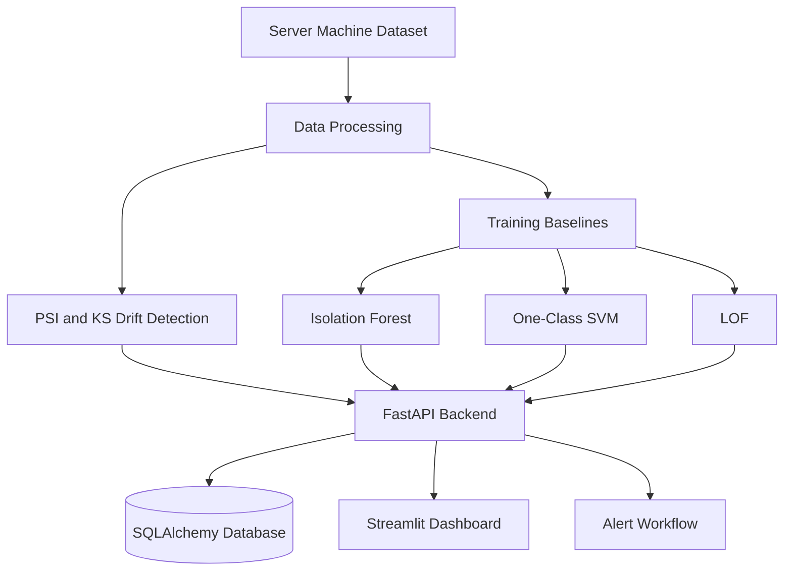
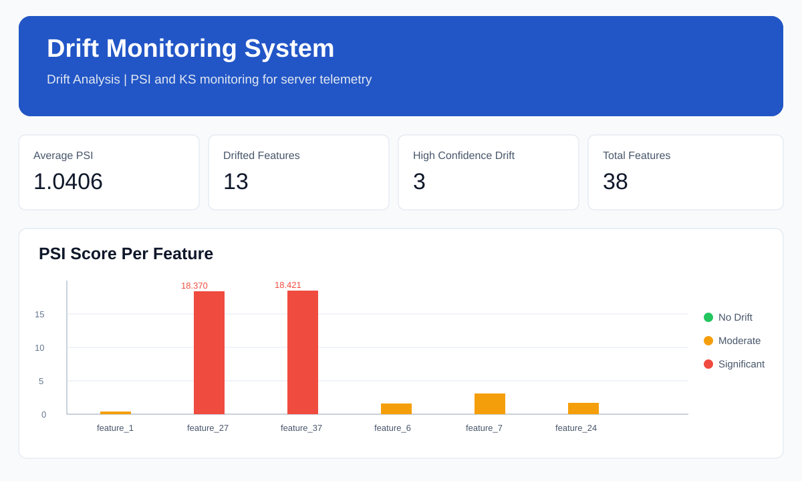

# Data Drift Detection & Monitoring System

## Overview

An end-to-end machine-learning monitoring system for Server Machine Dataset telemetry. It detects feature distribution changes, identifies abnormal server observations, evaluates unsupervised models, and exposes results through FastAPI and Streamlit.

## Problem Statement

Production data can differ from the data used to develop a model. A model may continue responding while its inputs have shifted or contain abnormal observations. This project provides one workflow for detecting both distribution drift and individual anomalies.

## Objectives

- Detect feature-level drift between reference and current server data.
- Detect abnormal observations in 38-feature telemetry batches.
- Compare Isolation Forest, One-Class SVM, and LOF.
- Evaluate predictions against labelled test data.
- Provide REST APIs, authentication, persistence, and an operator dashboard.
- Provide a foundation for alerting, retraining, and production ML monitoring.

## Key Features

- Data drift detection with PSI and KS-Test.
- High-confidence drift when both statistical signals agree.
- Machine-specific Isolation Forest monitoring models.
- One-Class SVM and Local Outlier Factor comparison.
- Accuracy, precision, recall, F1-score, and confusion matrix evaluation.
- FastAPI REST APIs with Swagger/OpenAPI.
- Streamlit dashboard for drift, evaluation, and monitoring.
- JWT authentication and password hashing.
- SQLAlchemy database models for users, results, and alerts.
- Docker deployment assets and automated tests.

## System Architecture



The system separates data analysis, model scoring, API delivery, persistence, and operator presentation. Training data establishes machine-specific baselines; current telemetry is evaluated for drift and anomalies before results reach the dashboard or alert workflow.

## Data Pipeline

```text
SMD train data -> machine baseline -> model training
SMD test data  -> PSI and KS comparison -> drift results
Telemetry batch -> schema validation -> Isolation Forest -> anomaly response
Labelled test data -> model predictions -> evaluation metrics
```

## Drift Detection

### PSI

Population Stability Index compares binned reference and current distributions.

```text
PSI = sum((current_percentage - reference_percentage)
          * ln(current_percentage / reference_percentage))
```

### KS-Test

The Kolmogorov-Smirnov test compares the cumulative distributions of reference and current values. The API records the KS statistic, p-value, and drift decision.

### Drift thresholds

| PSI | Interpretation |
| --- | --- |
| `<= 0.10` | No significant drift |
| `> 0.10` | Moderate drift |
| `> 0.25` | Significant drift; investigate and consider retraining |

The implementation marks a feature as high-confidence drift when PSI is significant and the KS test detects drift with `p-value < 0.05`.

## Anomaly Detection

### Isolation Forest

The primary monitoring model. It isolates observations using random decision trees; observations that are isolated quickly are treated as anomalies. It is suitable for high-dimensional server telemetry and scalable batch scoring.

### One-Class SVM

Learns a boundary around normal observations and identifies points outside that boundary as anomalies. It is useful as a comparison model but can be expensive on large datasets.

### LOF

Local Outlier Factor compares the density of an observation with its neighbours and detects contextual outliers. It can be computationally expensive for large datasets.

## Model Evaluation

The evaluation workflow uses labelled SMD test data and reports:

- Precision
- Recall
- F1-score
- Accuracy
- Confusion matrix
- Total samples and predicted anomalies

## Backend Architecture

The FastAPI backend contains route modules for authentication, drift analysis, evaluation, and monitoring. Services contain drift and inference logic. SQLAlchemy models provide persistence for users, drift results, monitoring results, and alerts. The application has a SQLite fallback for local development and MySQL-ready configuration.

## API Endpoints

| Method | Endpoint | Purpose |
| --- | --- | --- |
| `GET` | `/` | Redirects to Swagger UI |
| `GET` | `/health` | Health check |
| `POST` | `/signup` | Register a user |
| `POST` | `/login` | Authenticate and return a token |
| `GET` | `/profile` | Read the authenticated profile |
| `GET` | `/analyze-drift` | Analyze train/test drift for a machine |
| `POST` | `/evaluation/{machine_id}/run` | Run model evaluation |
| `GET` | `/monitor/status` | Show loaded machine models |
| `POST` | `/monitor` | Score a 38-feature telemetry batch |

`POST /monitor` expects `machine_id` and rows containing exactly 38 numeric features.

## Database Architecture

The database stores application and monitoring records through SQLAlchemy. Current models include users, drift results, monitoring results, and alerts. The alert record contains machine ID, alert type, severity, message, resolution state, and creation time.

## Dashboard

The Streamlit application provides three views:

- **Drift Analysis:** average PSI, drifted features, high-confidence drift, PSI chart, and KS results.
- **Model Evaluation:** evaluation metrics and model comparison results.
- **Monitor:** loaded models and anomaly scoring for telemetry batches.

### Dashboard results

The dashboard is the operator view of the application. The Drift Analysis screen shows the live API result: average PSI `1.0406`, `13` drifted features, `3` high-confidence drift features, and `38` total features.



| Dashboard view | Results shown in the app |
| --- | --- |
| **Drift Analysis** | Average PSI, drifted feature count, high-confidence drift count, total features, PSI chart, PSI status, KS statistic, and KS p-value |
| **Model Evaluation** | Accuracy, precision, recall, F1-score, total samples, predicted anomalies, and confusion matrix |
| **Monitor** | Loaded machine models, anomaly count, anomaly fraction, anomaly score, and severity |

### Model evaluation results

These charts belong to the separate Model Evaluation view, not the Drift Analysis dashboard:


To view the live dashboard results, start the API and Streamlit app using the commands in [Running Locally](#running-locally), then select a machine and run **Drift Analysis**, **Model Evaluation**, or **Monitor** from the dashboard.

### Dashboard workflow

| View | Operator action | Result |
| --- | --- | --- |
| Drift Analysis | Select a machine and PSI bucket count | Average PSI, drifted features, PSI chart, and KS results |
| Model Evaluation | Run evaluation for a machine | Precision, recall, F1-score, and confusion matrix |
| Monitor | Submit a 38-feature telemetry batch | Anomaly count, score, and severity |

### Video demonstration

This is separate from the evaluation images. When a real recording is available, add `docs/media/dashboard-demo.mp4`. The video should show the running dashboard, API status, Drift Analysis results, Model Evaluation results, and Monitor anomaly results. No video link is included until an actual recording is uploaded.

## Project Structure

```text
drift_monitoring_system/
├── backend/
│   ├── app/
│   │   ├── api/routes/       # Authentication, drift, evaluation, monitoring
│   │   ├── core/             # Configuration, security, logging, dependencies
│   │   ├── database/         # SQLAlchemy engine and sessions
│   │   ├── models/           # User, drift, monitor, and alert models
│   │   ├── schemas/          # API validation schemas
│   │   └── services/         # Drift and inference services
│   ├── scripts/              # Training and evaluation workflows
│   ├── tests/                # Automated tests
│   └── requirements.txt
├── dataset/ServerMachineDataset/ # Train, test, and test_label data
├── frontend/dashboard/       # Streamlit dashboard
├── docs/media/               # Evaluation images and future video
├── .streamlit/               # Streamlit settings
└── README.md
```

## Installation

### Prerequisites

- Python 3.11 or later
- Git
- MySQL and Docker for deployment environments

### Windows

```powershell
git clone https://github.com/Tilakkale/drift_detection_monitoring_system.git
Set-Location drift_detection_monitoring_system
python -m venv venv
.\venv\Scripts\Activate.ps1
python -m pip install -r backend/requirements.txt
```

## Environment Variables

The dashboard API URL can be configured without editing source code:

```powershell
$env:DRIFT_API_URL = "http://127.0.0.1:8000"
```

Database credentials and application secrets should be supplied through environment-specific configuration. Never commit passwords, tokens, or `.env` files.

## Running Locally

Start the API in one terminal:

```powershell
python -m uvicorn backend.app.main:app --host 0.0.0.0 --port 8000
```

Start the dashboard in a second terminal:

```powershell
$env:DRIFT_API_URL = "http://127.0.0.1:8000"
streamlit run frontend/dashboard/app.py --server.address 0.0.0.0 --server.port 8501
```

Open the dashboard at `http://127.0.0.1:8501`, Swagger at `http://127.0.0.1:8000/docs`, and health check at `http://127.0.0.1:8000/health`.

## Running with Docker

Docker assets are located in `backend/Docker/`. Validate database credentials, volumes, health checks, ports, and secrets against the target environment before deployment. Do not expose development containers directly to the public Internet.

## API Documentation

After starting the API, open:

```text
http://127.0.0.1:8000/docs
```

Swagger provides interactive request and response schemas for the available endpoints.

## Results

The verified evaluation summary reports the following Isolation Forest results for Machines 1, 2, and 3:

| Metric | Result |
| --- | ---: |
| Accuracy | `0.8746` |
| Precision | `1.0000` |
| Recall | `1.0000` |
| F1-score | `1.0000` |
| Test samples per machine | `194,374` |
| Predicted anomalies per machine | `34,101` |

These values come from the repository evaluation artifacts and should be rechecked on new data before making production claims. The reported results are dataset-specific and are not a guarantee of production performance.

## Monitoring Workflow

```text
Production telemetry
        |
        v
Validate machine ID and 38 features
        |
        +--> /monitor --> anomaly score and severity
        |
        +--> drift policy --> PSI and KS status
                              |
                              v
                    persist result and create alert
                              |
                              v
                   dashboard / incident workflow
```

## Limitations

- Evaluation is based on the included SMD data and three machines.
- The current repository does not provide automated retraining.
- Email, webhook, and incident-system alert delivery are not implemented.
- Historical drift tracking and model registry integration are not included.
- Production database, credentials, observability, and governance require deployment configuration.

## Future Improvements

- Add durable alert workers with email, webhook, or PagerDuty/SNS delivery.
- Add alert deduplication, retries, acknowledgement, and resolution workflows.
- Add historical drift and data-quality monitoring.
- Add model versioning, registry integration, and automated retraining gates.
- Add Prometheus/Grafana metrics, tracing, centralized logs, CI/CD, and role-based access control.
- Add integration tests for authentication, API contracts, persistence, alerts, and dashboard behavior.

## Testing

```powershell
python -m pytest backend/tests -q
```

The current backend test suite passes 3 tests in the verified development environment.

## Security

- Use JWT authentication for protected API routes.
- Store secrets in environment variables or a secret manager.
- Restrict CORS to trusted dashboard origins in production.
- Use TLS and an authenticated reverse proxy.
- Validate machine IDs, feature counts, data types, and payload size.
- Do not expose development servers or database ports publicly.
- Add audit logging and role-based access control before industrial rollout.

## Deployment

For an industrial deployment, run the API and dashboard as managed services or separate containers behind TLS. Use managed MySQL, database migrations, backups, health probes, structured logs, metrics, model versioning, data-quality gates, and a controlled alerting integration. The LAN command is suitable only for an internal demo.

## Research / Publication

This project demonstrates an integrated monitoring workflow combining statistical drift detection, unsupervised anomaly detection, model evaluation, APIs, persistence, and an operator dashboard. Any publication should report dataset splits, preprocessing, model parameters, contamination assumptions, evaluation protocol, limitations, and reproducible results.

